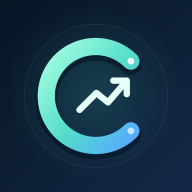

# 💚 CATHEU — Finanças a dois

**Seu dinheiro, mais claro. Seus planos, mais próximos.**

### [✨ Abrir a demonstração](https://msbraga47.github.io/catheu-demo/)

[📖 Conheça a experiência](docs/APRESENTACAO.md) · [✉️ Conversar com Matheus](mailto:msbraga47@gmail.com) · [🕰️ Versões](CHANGELOG.md)

**Beta 2.4.1 · Demonstração pública com dados fictícios**

## ✨ O CATHEU

O CATHEU reúne organização financeira e planejamento em uma experiência visual para celular e computador. Nasceu para cuidar das finanças compartilhadas e evolui como uma marca com potencial comercial.

A proposta é abrir o sistema e entender **o que entrou, o que saiu e para onde o dinheiro está indo**, com recursos que ajudam a transformar números em decisões.

## 🧪 Experimente o essencial

Esta demo é uma amostra interativa do produto. Você já encontra valores fictícios de setembro e outubro de 2026 para explorar sem configurar contas ou enviar arquivos.

| Na demonstração | O que você pode experimentar |
| --- | --- |
| 🏠 Panorama | Receitas, despesas e resultado do mês |
| 💸 Movimentações | Criar, editar e excluir exemplos de receitas e despesas |
| 🔎 Filtros | Buscar por descrição, escolher tipo e categoria |
| 📊 Categorias | Ver o peso dos gastos e tocar para abrir os lançamentos |
| 📅 Períodos | Alternar entre setembro e outubro de 2026 |
| ↺ Restaurar | Voltar aos valores fictícios iniciais |
| 📱 Celular | Usar controles adaptados a telas pequenas |

Os valores são **inteiramente fictícios**. As alterações ficam somente na sessão desta aba; não são enviadas a uma base financeira, não alteram a experiência de outros visitantes e não representam uma conta pessoal. O resultado mensal não é saldo bancário.

## 🚀 Conheça a experiência completa

O projeto completo inclui importação de extratos, cartões e faturas, contas a pagar, planejamento, investimentos e relatórios detalhados. Esses recursos **não são executados na demo**: seus atalhos abrem uma apresentação e o contato do responsável.

Quer entender o projeto, conversar sobre acesso, parceria ou desenvolvimento de uma solução para suas necessidades?

**✉️ [msbraga47@gmail.com](mailto:msbraga47@gmail.com)** — Matheus

## 🛣️ Produto em evolução

O CATHEU está em **beta**. Esta demo prioriza um conjunto pequeno de interações verificadas; não representa todos os recursos do sistema completo nem garante ausência de bugs em todo dispositivo. [Veja o escopo e as diferenças](docs/APRESENTACAO.md).

O histórico fica em uma seção discreta no rodapé da demo. Quando uma versão nova é publicada, a página consulta a disponibilidade e oferece atualização, sem recarregar automaticamente seu formulário.

## 🔐 Autoria e direitos

Projeto proprietário idealizado por **Matheus**, a partir das finanças compartilhadas com Carol. A demo é aberta para conhecer a experiência; isso **não torna o produto completo gratuito ou de código aberto**. As condições de acesso e comercialização são tratadas diretamente com o responsável.

Este repositório contém apenas a demonstração. O sistema completo e sua base financeira permanecem separados. Consulte os [direitos de uso](LICENSE.md).
